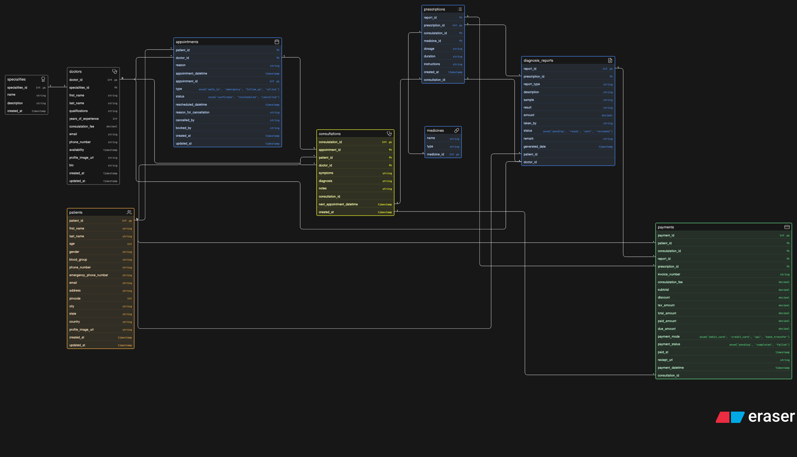

# Clinic Appointment & Diagnostics Platform — ERD

Designed an ER diagram for a clinic system that handles appointments, consultations, diagnostics, reports, and payments.

Tried to keep it simple and realistic.

## ER Diagram

---

## Context

A clinic wants to digitize its operations:

* manage doctors and their specialties
* handle patient records
* allow appointment booking
* track consultations
* support diagnostic tests and reports
* manage payments

Patients can visit multiple times, doctors can handle many patients, and consultations can lead to tests and reports.

---

## What I Modeled

Focused on the core flow:

**Patient → Appointment → Consultation → Prescription → Diagnosis → Payment**

### Entities:

* Specialities
* Doctors
* Patients
* Appointments
* Consultations
* Prescriptions
* Medicines
* Diagnosis Reports
* Payments

---

## 🔗 Key Relationships

* A doctor belongs to a speciality
* A patient can book multiple appointments
* An appointment connects a patient and a doctor
* An appointment may lead to a consultation
* A consultation can generate prescriptions
* A prescription can lead to multiple diagnostic reports
* Reports are linked back to **patient and doctor
* Payments can be tied to:

  * consultations
  * prescriptions
  * diagnostic reports

---

## Final Thoughts

Tried to balance:

* real-world use cases
* simplicity
* and scalability

Not perfect, but a solid starting point.

Would love feedback — especially on:

* relationships
* missing edge cases
* or overengineering

---
