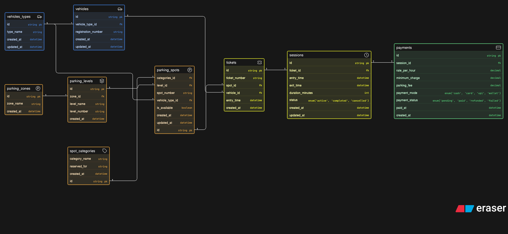

# Comic-Con Parking System — ERD

Designed an ER diagram for a multi-zone event parking system that handles vehicle entry, spot allocation, reserved parking, session tracking, and payments.

Tried to keep it scalable and realistic for a large-scale convention venue.

## ER Diagram

---

## Context

A large convention venue hosting Comic-Con India needs to manage parking for thousands of visitors attending:

* anime screenings
* cosplay competitions
* gaming showcases
* creator meetups
* merchandise zones
* panel discussions

Visitors arrive using different vehicle types (bikes, cars, SUVs, cabs, EVs), and the venue has:

* multiple parking zones
* multiple levels per zone
* reserved areas for cosplayers with props, exhibitors, creators, VIPs, staff, and EV charging

The system needs to:

* track vehicles entering and exiting
* assign suitable parking spots based on vehicle type and availability
* manage reserved parking categories
* calculate parking fees based on duration
* track payment status

---

## What I Modeled

Vehicle Entry → Spot Allocation → Parking Session → Exit & Payment

### Entities:

* Vehicle Types
* Vehicles
* Parking Zones
* Parking Levels
* Spot Categories
* Parking Spots
* Tickets
* Sessions
* Payments

---

## Key Relationships

* A vehicle belongs to a vehicle type (bike, car, SUV, cab, EV)
* Zones contain multiple levels
* Levels contain multiple parking spots
* Spots are assigned a category (general, VIP, cosplayer, EV charging, etc.)
* Spots are compatible with specific vehicle types
* A vehicle gets a ticket when entering, assigned to a specific spot
* A ticket creates a session that tracks entry and exit times
* A session generates a payment record with fee calculation

---

## Design Decisions

Why separate zones and levels?
Allows the venue to organize parking hierarchically (Zone A → Level 1, Level 2, etc.)

Why track vehicle type at the spot level?
Ensures bikes don't get assigned SUV spots and vice versa

Why one-to-one relationship between ticket and session?
Each ticket represents a single parking instance with clear entry/exit tracking

Why separate session and payment?
Allows tracking unpaid sessions and supports different payment modes and statuses

---

Not perfect, but covers the essentials for a large event parking system.

Would love feedback, especially on:

* handling multi-day parking scenarios
* peak hour spot optimization
* pre-booking vs walk-in allocation
* or anything I might have overengineered
