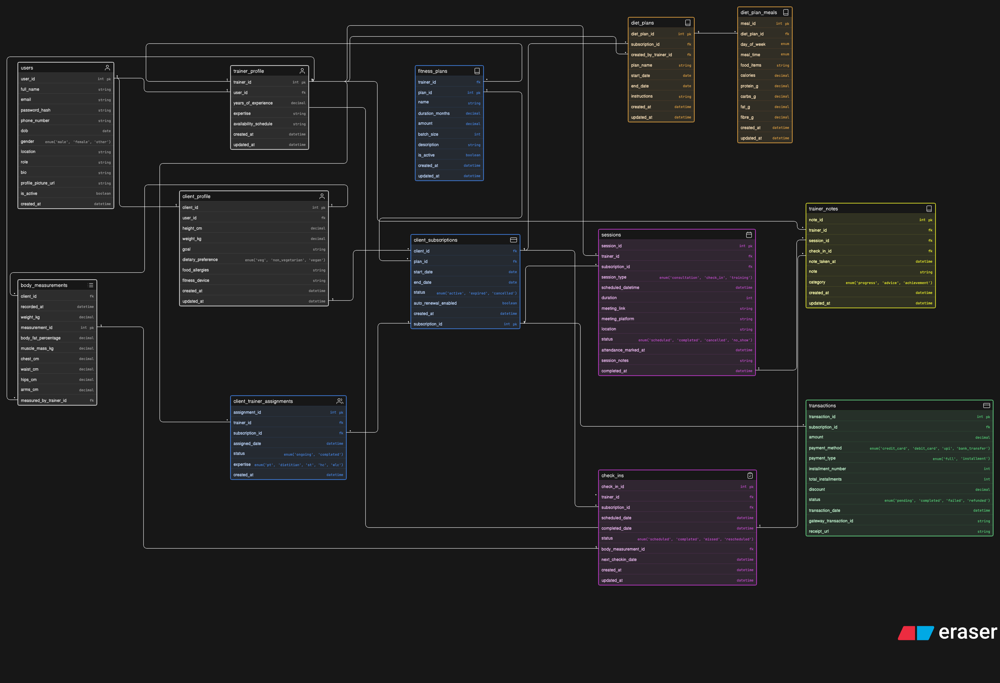

# Fitness Coaching Platform — ERD

Designed an ER diagram for a fitness coaching platform that connects trainers and clients, manages subscriptions, tracks sessions, monitors progress, and handles payments.

Tried to keep it structured and scalable for real-world coaching workflows.

---

## ER Diagram

---

## Context

This system is built for an online fitness coaching platform where:

* trainers create fitness plans  
* clients subscribe to those plans  
* sessions (consultations, training, check-ins) are scheduled  
* progress is tracked through body measurements  
* diet plans are assigned  
* payments and subscriptions are managed  

The platform supports:

* personal coaching  
* batch-based programs  
* recurring subscriptions  
* structured progress tracking  

---

## What I Modeled

User → Profile → Subscription → Sessions → Progress → Payments

### Entities:

* Users  
* Trainer Profile  
* Client Profile  
* Fitness Plans  
* Client Subscriptions  
* Client-Trainer Assignments  
* Sessions  
* Check-ins  
* Body Measurements  
* Diet Plans  
* Diet Plan Meals  
* Trainer Notes  
* Transactions  

---

## Key Relationships

* A user can be either a trainer or a client (role-based system)  

* A trainer:
  * has a trainer profile  
  * creates multiple fitness plans  

* A client:
  * has a client profile  
  * can subscribe to fitness plans  

* A subscription:
  * links a client to a fitness plan  
  * has a lifecycle (active, expired, cancelled)  

* A trainer is assigned to a client via subscription  

* Sessions:
  * belong to a trainer + subscription  
  * can be consultation, check-in, or training  
  * track attendance and completion  

* Check-ins:
  * scheduled periodically  
  * linked to body measurements  

* Body measurements:
  * track progress over time (weight, fat %, etc.)  

* Diet plans:
  * created by trainers  
  * assigned per subscription  

* Diet plan meals:
  * define daily structured meals with macros  

* Trainer notes:
  * linked to sessions/check-ins  
  * categorized (progress, advice, achievement)  

* Transactions:
  * linked to subscriptions  
  * handle payments, installments, and status  

---

## Design Decisions

**Why separate user, trainer_profile, and client_profile?**  
Keeps authentication generic while allowing role-specific data without cluttering a single table.

**Why use subscriptions instead of direct client-plan mapping?**  
Subscriptions help track lifecycle (start, end, renewals) and allow better billing control.

**Why introduce client_trainer_assignments?**  
Decouples trainer allocation from subscription logic and allows flexibility (change trainers, multiple expertise mapping).

**Why separate sessions and check-ins?**  
Sessions handle real-time interactions, while check-ins focus on structured progress tracking.

**Why track body measurements separately?**  
Progress is time-series data and should not be overwritten.

**Why separate diet plans and meals?**  
Allows reusable diet plans and structured daily breakdown with macros.

**Why transactions instead of simple payment fields?**  
Supports multiple payment modes, installments, retries, and refunds.

---

Not perfect, but covers most real-world needs of a fitness coaching platform.

Would love feedback on:

* handling group sessions vs 1:1 sessions  
* plan upgrades/downgrades mid-subscription  
* or anything that feels overengineered / missing  