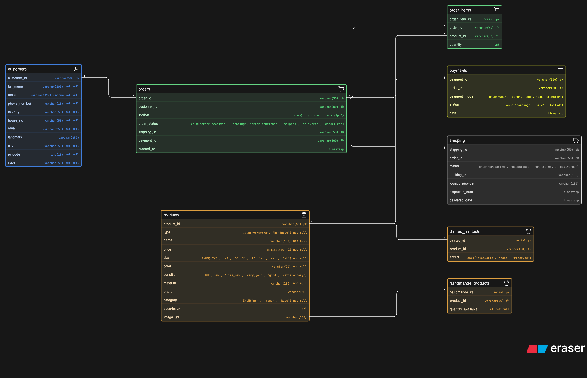

# Thrift & Handmade Store — ERD

Designed an ER diagram for a small-scale thrift + handmade product store that handles customer orders, product variations, payments, and shipping.

Tried to keep it simple but flexible enough to support both unique thrift items and inventory-based handmade products.

---

## ER Diagram

---

## Context

This system is built for a store selling products via platforms like Instagram and WhatsApp.

The store deals with two types of products:

* **Thrifted items** → usually one-of-one (unique pieces)
* **Handmade products** → can have multiple quantities

Customers place orders through DMs or chats, and the system needs to:

* store customer details
* manage different product types
* handle order creation
* track item-level quantities
* manage payments (UPI, COD, etc.)
* track shipping and delivery status

---

## What I Modeled

Customer → Order → Order Items → Payment → Shipping

### Entities:

* Customers  
* Orders  
* Order Items  
* Products  
* Thrifted Products  
* Handmade Products  
* Payments  
* Shipping  

---

## Key Relationships

* A customer can place multiple orders  
* An order belongs to a single customer  
* An order contains multiple order items  
* Each order item maps to a product  

* A product can be:
  * thrifted (unique, tracked individually)
  * handmade (quantity-based inventory)

* Each order has:
  * one payment record  
  * one shipping record  

* Thrifted products track availability (available / sold / reserved)  
* Handmade products track quantity available  

---

## Design Decisions

**Why separate thrifted and handmade products?**  
Thrifted items are unique (one piece), while handmade products can have stock. Keeping them separate avoids messy conditional logic.

**Why introduce order_items?**  
Allows multiple products in a single order and keeps quantity handling clean.

**Why keep payment separate from orders?**  
Helps track payment status independently (pending, paid, failed) and supports different payment modes.

**Why separate shipping?**  
Shipping has its own lifecycle (preparing → dispatched → delivered), which is better handled outside the order table.

---

Not perfect, but covers most real-world needs for a small creator-led store.

Would love feedback on:

* handling returns/refunds  
* partial payments or advance payments  
* inventory syncing for handmade products  
* or anything that feels overcomplicated / missing