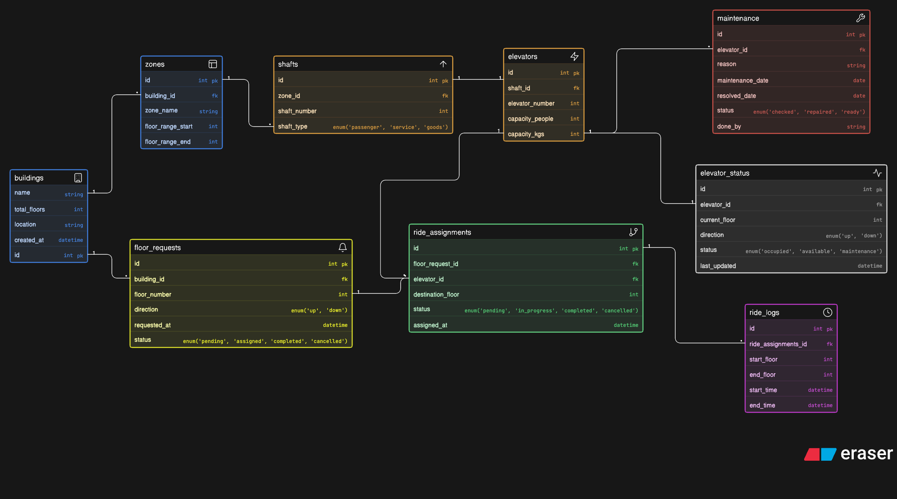

# Smart Elevator Control — ERD

Designed an ER diagram for a multi-building intelligent elevator control system that handles floor requests, elevator assignments, ride tracking, status monitoring, and maintenance logging.

Tried to keep it scalable and realistic for a large commercial buildings across India. 

## ER Diagram

---

## Context

LiftGrid Systems builds intelligent elevator control platforms used in:

* corporate towers
* shopping malls
* airports
* hospitals
* high-rise residential complexes

There are dozens of elevators operating together across many floors, handling thousands of passengers daily. Elevators are grouped into zones within each building, and the system needs to coordinate all of them efficiently.

The system needs to support:
* floor-level request tracking
* ride allocation to elevators
* elevator status monitoring
* maintenance tracking
* usage history logging

---

## What I Modeled

Builidngs → Zones → Shafts → Elevators → Floor Request → Ride Assignment → Ride Log

### Entities:

* Buildings
* Zones
* Shafts
* Elevators
* Floor Requests
* Ride Assignments
* Elevator Status
* Ride Logs
* Maintenance

---

## Key Relationships

* A building is divided into zones covering specific floor ranges
* Each zone contains multiple elevator shafts
* Each shaft houses exactly one elevator
* A passenger pressing a floor button creates a floor request tied to a building and floor number
* The system assigns an elevator to that request via ride assignments
* Once the ride is complete, a ride log entry is created with trip details
* Each elevator has a live status record tracking its current floor, direction, and availability
* Maintenance records are logged per elevator with reason, dates, and resolution status

---

Not perfect, but covers the core operations of a real elevator control system.

Would love feedback, especially on:

* handling peak hour demand across zones
* elevator prioritization logic for hospitals vs malls vs high-rise buildings
* or anything I might have overengineered