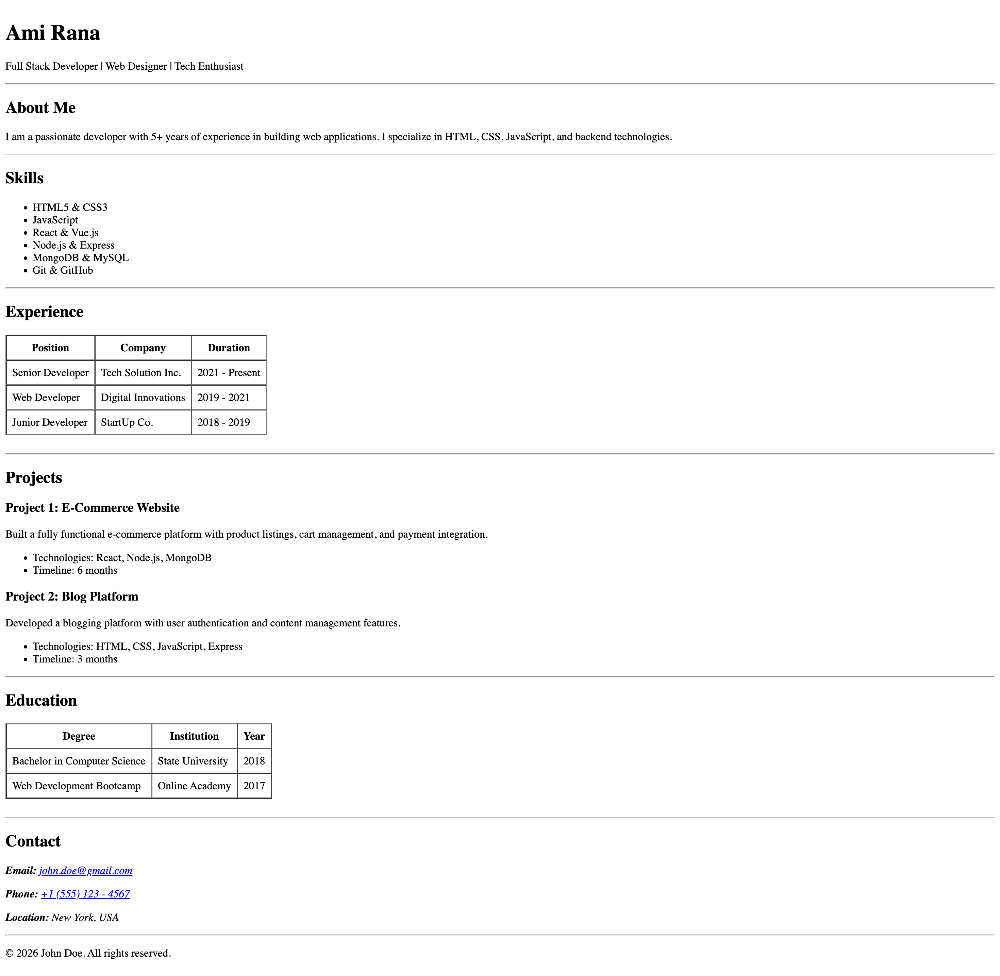

# Single Page Resume (HTML Only)

This is a simple single-page resume website built using pure HTML5.  
No CSS and no JavaScript are used on purpose.

---

## What is this project for?

- Learning HTML5 semantic tags
- Practicing tables, lists, and text structure
- Creating a clean resume layout using only HTML
- Making a reusable template that anyone can clone and edit

---

## How to use this project

1. Clone the repository  
2. Open `index.html` in your browser  
3. Replace the placeholder content with your own details  
4. Save the file and refresh the browser

That’s it.

---

## Notes

- You are free to modify, extend, or style it later if you want

---

## Screenshot / Demo

